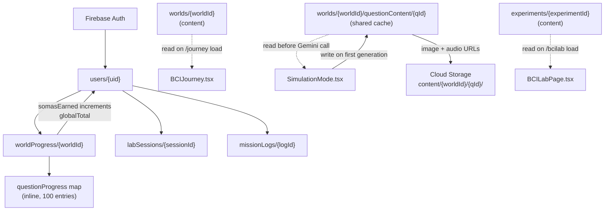

# Firestore Schema — BCI Journey: The Neuro-Link

**Backend:** Firebase (Firestore, Auth, Cloud Storage) + GCP
**Last updated:** 2026-02-20

---

## Collection Tree

```
firestore/
├── users/{uid}                                    ← user profile, settings, global Somas
│   ├── worldProgress/{worldId}                    ← per-world progress with inline question map
│   ├── labSessions/{sessionId}                    ← one document per BCI Lab experiment run
│   └── missionLogs/{logId}                        ← one document per question-node session
├── worlds/{worldId}                               ← content: brain world definitions
│   └── questionContent/{questionId}               ← shared AI-generated content cache
└── experiments/{experimentId}                     ← content: BCI Lab experiment catalog

cloud-storage/
└── content/{worldId}/{questionId}/
    ├── exchange-{index}-image.png                 ← generated illustration per dialogue step
    └── exchange-{index}-audio-{speaker}.wav       ← generated TTS per dialogue step
```

All user-owned data is nested under `users/{uid}`. Content collections (`worlds`, `experiments`) are read by all authenticated users and written only by admins. The shared content cache under `worlds/{worldId}/questionContent` is written by Cloud Functions (or the first requesting client) and read by all authenticated users.

---

## Data Flow



---

## `users/{uid}`

**Document ID:** Firebase Auth UID (e.g. `abc123xyz`)

Created on first login. `totalSomas` is the global running balance incremented each time a quiz question is answered correctly in any world. Profile and interface-settings fields are populated during onboarding or from the settings screen.

### Profile fields

| Field | Type | Required | Notes |
|---|---|---|---|
| `displayName` | `string` | yes | Sourced from Firebase Auth or onboarding form |
| `email` | `string` | yes | Sourced from Firebase Auth |
| `photoURL` | `string \| null` | yes | Profile photo URL; null if not set |
| `birthYear` | `number \| null` | no | e.g. `2012`; avoids storing exact birthdate (minor privacy) |
| `schoolName` | `string \| null` | no | Free-text or selected from a list |
| `country` | `string \| null` | no | ISO 3166-1 alpha-2 code (e.g. `"US"`, `"CN"`, `"TH"`) |
| `language` | `string` | yes | UI language preference; defaults to `"en"` |
| `role` | `string` | yes | `"student"` or `"teacher"` |
| `avatarId` | `string \| null` | no | Selected avatar/character skin identifier |
| `createdAt` | `Timestamp` | yes | Set once on account creation |
| `lastLoginAt` | `Timestamp` | yes | Updated on every login |
| `totalSomas` | `number` | yes | Global Somas balance across all worlds; starts at `0` |
| `onboardingComplete` | `boolean` | yes | `false` until user completes the onboarding flow |

### `interfaceSettings` map

Stored inline on the `users/{uid}` document. Controls UI/UX preferences that persist across sessions.

| Sub-field | Type | Required | Default | Notes |
|---|---|---|---|---|
| `autoPlay` | `boolean` | yes | `true` | Auto-advance dialogue in Listen mode |
| `voiceSpeed` | `number` | yes | `1.0` | TTS playback rate multiplier (`0.5`–`2.0`) |
| `particlesEnabled` | `boolean` | yes | `true` | Toggle 3D particle effects (performance) |
| `showTutorials` | `boolean` | yes | `true` | Show intro overlay and tooltips |

**Example document:**

```json
{
  "displayName": "Neural Explorer",
  "email": "user@example.com",
  "photoURL": null,
  "birthYear": 2012,
  "schoolName": "Greenfield Academy",
  "country": "US",
  "language": "en",
  "role": "student",
  "avatarId": "cyber-fox",
  "createdAt": "2026-02-20T10:00:00Z",
  "lastLoginAt": "2026-02-20T14:32:00Z",
  "totalSomas": 340000000,
  "onboardingComplete": true,
  "interfaceSettings": {
    "autoPlay": true,
    "voiceSpeed": 1.0,
    "particlesEnabled": true,
    "showTutorials": false
  }
}
```

---

## `users/{uid}/worldProgress/{worldId}`

**Document ID:** World ID as a string (e.g. `"1"` through `"10"`)

One document per world the user has interacted with. The `questionProgress` map is stored inline — with 100 questions and ~6 fields each the document stays well under Firestore's 1 MB limit (~15 KB).

`completionPercentage` is a denormalized field, recomputed and stored on every write to avoid counting array length client-side at read time.

`somasEarned` reflects only this world's earnings. The global `users/{uid}.totalSomas` is incremented atomically via a Firestore transaction every time `somasEarned` is updated here.

| Field | Type | Required | Notes |
|---|---|---|---|
| `worldId` | `number` | yes | `1`–`10`; matches `WorldData.id` in `constants.ts` |
| `somasEarned` | `number` | yes | Per-world Somas subtotal; starts at `0` |
| `completedQuestions` | `number[]` | yes | Array of `questionId`s where `isActivated = true`; drives node-unlock logic |
| `completionPercentage` | `number` | yes | `0`–`100`; `(completedQuestions.length / 100) * 100` rounded |
| `firstStartedAt` | `Timestamp` | yes | Set once on first interaction |
| `lastUpdatedAt` | `Timestamp` | yes | Updated on every write |
| `questionProgress` | `map` | yes | Keyed by `questionId` as a string (e.g. `"42"`); see sub-fields below |

### `questionProgress` map entry fields

Each key in the map is a string `questionId`. Values are objects with the following shape:

| Sub-field | Type | Required | Notes |
|---|---|---|---|
| `hasListened` | `boolean` | yes | User completed Listen mode for this question |
| `hasTalked` | `boolean` | yes | User completed Talk (live voice) mode |
| `hasReadSummary` | `boolean` | yes | User opened the AI Summary for this question |
| `isActivated` | `boolean` | yes | `true` when quiz is passed; triggers node visual change to "completed" |
| `quizScore` | `number \| null` | yes | Quiz result, `0`–`5`; `null` if quiz not yet taken |
| `completedAt` | `Timestamp \| null` | yes | Timestamp when `isActivated` was first set to `true`; `null` before |

**Example document:**

```json
{
  "worldId": 1,
  "somasEarned": 85000000,
  "completedQuestions": [1, 2, 5],
  "completionPercentage": 3,
  "firstStartedAt": "2026-02-20T10:05:00Z",
  "lastUpdatedAt": "2026-02-20T14:10:00Z",
  "questionProgress": {
    "1": {
      "hasListened": true,
      "hasTalked": false,
      "hasReadSummary": true,
      "isActivated": true,
      "quizScore": 5,
      "completedAt": "2026-02-20T10:30:00Z"
    },
    "2": {
      "hasListened": true,
      "hasTalked": true,
      "hasReadSummary": false,
      "isActivated": true,
      "quizScore": 4,
      "completedAt": "2026-02-20T11:00:00Z"
    },
    "5": {
      "hasListened": false,
      "hasTalked": false,
      "hasReadSummary": false,
      "isActivated": false,
      "quizScore": null,
      "completedAt": null
    }
  }
}
```

---

## `users/{uid}/missionLogs/{logId}`

**Document ID:** Firestore auto-generated ID

One document per question-node session. Created when a user selects a node in the Neural Navigator and enters any learning mode. Captures what happened during that visit: which modes were used, how long it took, and what was earned.

| Field | Type | Required | Notes |
|---|---|---|---|
| `worldId` | `number` | yes | `1`–`10` |
| `questionId` | `number` | yes | `1`–`100` within the world |
| `question` | `string` | yes | Denormalized question text for display in history |
| `startedAt` | `Timestamp` | yes | Set when the node session begins |
| `endedAt` | `Timestamp \| null` | yes | `null` if user navigated away without finishing |
| `durationSeconds` | `number \| null` | yes | `endedAt - startedAt` in seconds; `null` if incomplete |
| `modesUsed` | `string[]` | yes | Subset of `["listen", "talk", "summary", "quiz"]`; ordered by use |
| `talkCharacter` | `string \| null` | yes | `"Synapse"` or `"Spark"` if Talk mode was used; `null` otherwise |
| `quizScore` | `number \| null` | yes | `0`–`5`; `null` if quiz was not attempted in this session |
| `somasEarned` | `number` | yes | Somas earned during this session; `0` if no quiz or quiz failed |

**Example document:**

```json
{
  "worldId": 1,
  "questionId": 7,
  "question": "What is the left hemisphere responsible for?",
  "startedAt": "2026-02-20T11:05:00Z",
  "endedAt": "2026-02-20T11:18:45Z",
  "durationSeconds": 825,
  "modesUsed": ["listen", "summary", "quiz"],
  "talkCharacter": null,
  "quizScore": 4,
  "somasEarned": 68000000
}
```

---

## `users/{uid}/labSessions/{sessionId}`

**Document ID:** Firestore auto-generated ID

One document is created when a user starts a BCI Lab experiment via `ExperimentStartPage.tsx`. `completedAt` is written when the session ends. Sessions that the user exits early will have `completedAt: null`.

The `result` map is intentionally flexible — each experiment paradigm may record different outcome data (e.g., P300 Speller records the spelled word; Motor Imagery Classifier records left/right accuracy).

| Field | Type | Required | Notes |
|---|---|---|---|
| `experimentId` | `string` | yes | Matches `Experiment.id` in `data/experiments.ts` (e.g. `"p300-speller"`) |
| `experimentTitle` | `string` | yes | Denormalized for display in history views |
| `category` | `string` | yes | `"BCI"`, `"ERP"`, `"Motor Imagery"`, `"Neurofeedback"`, or `"Cognitive"` |
| `difficulty` | `string` | yes | `"Beginner"`, `"Intermediate"`, or `"Advanced"` |
| `startedAt` | `Timestamp` | yes | Set when session document is first created |
| `completedAt` | `Timestamp \| null` | yes | `null` if user exited early; set when experiment ends normally |
| `durationSeconds` | `number \| null` | yes | `null` if not completed; `completedAt - startedAt` in seconds |
| `score` | `number \| null` | yes | Experiment-specific numeric score; `null` if not applicable or incomplete |
| `result` | `map \| null` | yes | Flexible experiment-specific outcome payload; `null` if session incomplete |

**Example document:**

```json
{
  "experimentId": "p300-speller",
  "experimentTitle": "P300 Speller",
  "category": "BCI",
  "difficulty": "Intermediate",
  "startedAt": "2026-02-20T13:00:00Z",
  "completedAt": "2026-02-20T13:08:30Z",
  "durationSeconds": 510,
  "score": 92,
  "result": {
    "spelledWord": "BRAIN",
    "accuracy": 0.92,
    "trialsCompleted": 25
  }
}
```

---

## `worlds/{worldId}` (content collection)

**Document ID:** World ID as a string (e.g. `"1"` through `"10"`)

Mirrors the `WORLDS` array in `constants.ts`. Storing this in Firestore allows world descriptions, learning objectives, and connection graphs to be updated from the Firebase Console without a code redeploy. The app can fall back to the hardcoded `constants.ts` values if Firestore is unavailable.

| Field | Type | Required | Notes |
|---|---|---|---|
| `id` | `number` | yes | `1`–`10` |
| `name` | `string` | yes | Full display name (e.g. `"Brain Anatomy - The Control Center"`) |
| `region` | `string` | yes | Anatomical label shown in the UI (e.g. `"Cerebral Atlas"`) |
| `description` | `string` | yes | Short description shown in the world info panel |
| `color` | `string` | yes | Hex color for the 3D node and UI accents (e.g. `"#00f3ff"`) |
| `position` | `map {x, y, z}` | yes | 3D coordinates for the brain map scene |
| `connections` | `number[]` | yes | IDs of other worlds this node visually connects to |
| `isLocked` | `boolean` | yes | Default/initial lock state; actual unlock state is derived from user progress |
| `learningObjective` | `string` | yes | Short goal statement (e.g. `"Master the map of the human brain."`) |
| `questionCount` | `number` | yes | Total questions available; `100` for all current worlds |

**Example document:**

```json
{
  "id": 1,
  "name": "Brain Anatomy - The Control Center",
  "region": "Cerebral Atlas",
  "description": "Explore the biological architecture of the brain, from lobes to the brainstem.",
  "color": "#00f3ff",
  "position": { "x": 0, "y": 1.5, "z": 3 },
  "connections": [2, 5, 9],
  "isLocked": false,
  "learningObjective": "Master the map of the human brain.",
  "questionCount": 100
}
```

---

## `worlds/{worldId}/questionContent/{questionId}` (shared content cache)

**Document ID:** Question ID as a string (e.g. `"1"` through `"100"`)

Caches AI-generated content so that multiple users hitting the same question do not each trigger separate Gemini API calls. The app checks this document before calling `geminiService.ts` functions. If the document exists and `status` is `"complete"`, the cached content is used directly. If it is missing or `"failed"`, the app generates fresh content and writes it back here.

Text content (dialogue scripts, summary points, quiz questions) is stored directly in the document. Binary content (images and audio) is stored in **Cloud Storage** at `content/{worldId}/{questionId}/` — only the download URLs are kept in Firestore.

### Top-level fields

| Field | Type | Required | Notes |
|---|---|---|---|
| `worldId` | `number` | yes | Parent world |
| `questionId` | `number` | yes | `1`–`100` |
| `question` | `string` | yes | The question text |
| `status` | `string` | yes | `"pending"`, `"complete"`, or `"failed"` |
| `generatedAt` | `Timestamp \| null` | yes | When generation completed; `null` if pending/failed |
| `modelVersion` | `string \| null` | yes | Gemini model used (e.g. `"gemini-3-flash-preview"`); `null` if not yet generated |
| `script` | `map \| null` | yes | Cached output of `generateSimulationScript()`; see sub-fields below |
| `summaryPoints` | `string[] \| null` | yes | Cached output of `generateLessonSummary()`; 3 key takeaway strings |
| `quiz` | `array \| null` | yes | Cached output of `generateNeuronQuiz()`; see sub-fields below |

### `script` map

Mirrors the `SimulationScript` type from `types.ts`.

| Sub-field | Type | Notes |
|---|---|---|
| `script.question` | `string` | The dialogue title/question |
| `script.exchanges` | `array` | Array of exchange maps (see below) |

### `script.exchanges[]` array entry

Each entry mirrors `DialogueExchange` from `types.ts`, plus cached media URLs.

| Sub-field | Type | Notes |
|---|---|---|
| `speaker` | `string` | `"Synapse"`, `"Spark"`, or `"Both"` |
| `text` | `string` | Dialogue line |
| `imagePrompt` | `string` | Original prompt sent to image generation |
| `imageURL` | `string \| null` | Cloud Storage download URL for the generated image |
| `audioURL` | `string \| null` | Cloud Storage download URL for the generated TTS audio |

### `quiz[]` array entry

Each entry mirrors the `QuizQuestion` interface from `geminiService.ts`.

| Sub-field | Type | Notes |
|---|---|---|
| `question` | `string` | Quiz question text |
| `options` | `string[]` | 4 answer options |
| `correctAnswer` | `number` | Index of correct option (`0`–`3`) |
| `explanation` | `string` | Why the answer is correct |

**Example document:**

```json
{
  "worldId": 1,
  "questionId": 7,
  "question": "What is the left hemisphere responsible for?",
  "status": "complete",
  "generatedAt": "2026-02-20T09:00:00Z",
  "modelVersion": "gemini-3-flash-preview",
  "script": {
    "question": "What is the left hemisphere responsible for?",
    "exchanges": [
      {
        "speaker": "Synapse",
        "text": "The left hemisphere is like the brain's language center and logic processor...",
        "imagePrompt": "Cross-section of the human brain highlighting the left hemisphere with glowing neural pathways connecting to speech and math centers",
        "imageURL": "https://storage.googleapis.com/bci-journey-content/content/1/7/exchange-0-image.png",
        "audioURL": "https://storage.googleapis.com/bci-journey-content/content/1/7/exchange-0-audio-synapse.wav"
      },
      {
        "speaker": "Spark",
        "text": "Think of it like the CPU core that handles all the precise calculations...",
        "imagePrompt": "A futuristic CPU chip with glowing circuits processing language symbols and mathematical equations",
        "imageURL": "https://storage.googleapis.com/bci-journey-content/content/1/7/exchange-1-image.png",
        "audioURL": "https://storage.googleapis.com/bci-journey-content/content/1/7/exchange-1-audio-spark.wav"
      },
      {
        "speaker": "Both",
        "text": "Together, the left hemisphere gives you the power of language, logic, and analytical thinking!",
        "imagePrompt": "Split view showing biological neurons on the left merging with digital circuits on the right, both processing language",
        "imageURL": "https://storage.googleapis.com/bci-journey-content/content/1/7/exchange-2-image.png",
        "audioURL": "https://storage.googleapis.com/bci-journey-content/content/1/7/exchange-2-audio-synapse.wav"
      }
    ]
  },
  "summaryPoints": [
    "The left hemisphere controls language, speech, and reading.",
    "It handles logical thinking, math, and analytical tasks.",
    "It primarily controls the right side of the body."
  ],
  "quiz": [
    {
      "question": "What is the left hemisphere primarily responsible for?",
      "options": ["Creativity and art", "Language and logic", "Emotions and feelings", "Physical balance"],
      "correctAnswer": 1,
      "explanation": "The left hemisphere is the brain's center for language processing and logical reasoning."
    },
    {
      "question": "Which side of the body does the left hemisphere mainly control?",
      "options": ["Left side", "Right side", "Both sides equally", "Neither side"],
      "correctAnswer": 1,
      "explanation": "The brain's wiring is crossed — the left hemisphere controls the right side of the body."
    },
    {
      "question": "If the left hemisphere is like a CPU, what does it process?",
      "options": ["Colors and images", "Music and rhythm", "Calculations and language", "Smell and taste"],
      "correctAnswer": 2,
      "explanation": "Spark's analogy compares the left hemisphere to a CPU that handles precise calculations and language."
    },
    {
      "question": "Which character explains the biological side of the brain?",
      "options": ["Spark", "Synapse", "Nova", "Cortex"],
      "correctAnswer": 1,
      "explanation": "Synapse is the biological expert who explains how the brain works organically."
    },
    {
      "question": "What would be difficult if the left hemisphere was damaged?",
      "options": ["Seeing colors", "Speaking and reading", "Hearing music", "Feeling temperature"],
      "correctAnswer": 1,
      "explanation": "Since the left hemisphere handles language, damage to it can affect speech and reading abilities."
    }
  ]
}
```

### Cloud Storage layout

Binary assets are stored outside Firestore to avoid the 1 MB document limit. The bucket path convention:

```
gs://bci-journey-content/content/{worldId}/{questionId}/
├── exchange-0-image.png
├── exchange-0-audio-synapse.wav
├── exchange-1-image.png
├── exchange-1-audio-spark.wav
├── exchange-2-image.png
└── exchange-2-audio-synapse.wav
```

File naming: `exchange-{index}-image.png` and `exchange-{index}-audio-{speaker}.wav` where `speaker` is lowercased (`synapse`, `spark`).

---

## `experiments/{experimentId}` (content collection)

**Document ID:** Experiment slug (e.g. `"p300-speller"`)

Mirrors the `experiments` array in `data/experiments.ts`. Storing in Firestore allows admins to update ratings, add new experiments, or modify tags without a redeploy.

| Field | Type | Required | Notes |
|---|---|---|---|
| `id` | `string` | yes | URL-safe slug (e.g. `"motor-imagery-classifier"`) |
| `title` | `string` | yes | Display title (e.g. `"Motor Imagery Classifier"`) |
| `category` | `string` | yes | `"BCI"`, `"ERP"`, `"Motor Imagery"`, `"Neurofeedback"`, or `"Cognitive"` |
| `description` | `string` | yes | Paragraph shown on the experiment card |
| `difficulty` | `string` | yes | `"Beginner"`, `"Intermediate"`, or `"Advanced"` |
| `rating` | `number` | yes | Aggregate star rating; updatable by admins (e.g. `4.7`) |
| `tags` | `string[]` | yes | Searchable tags (e.g. `["EEG", "P300", "Spelling"]`) |
| `icon` | `string` | yes | Lucide React icon name (e.g. `"Keyboard"`) |
| `color` | `string` | yes | Hex accent color for the experiment card |

**Example document:**

```json
{
  "id": "p300-speller",
  "title": "P300 Speller",
  "category": "BCI",
  "description": "Use event-related potentials to spell words by focusing on flashing characters on a grid. A classic BCI paradigm.",
  "difficulty": "Intermediate",
  "rating": 4.7,
  "tags": ["EEG", "P300", "Spelling", "Event-Related Potential"],
  "icon": "Keyboard",
  "color": "#00f3ff"
}
```

---

## Security Rules

These rules implement the principle of least privilege. Users can only read and write their own data. Content collections are publicly readable by authenticated users and writable only by admins. The shared question content cache is readable by all authenticated users and writable by Cloud Functions (via admin SDK, which bypasses rules) or by any authenticated user (for the client-side "generate and cache" pattern — tighten to admin-only if using Cloud Functions exclusively).

```javascript
rules_version = '2';
service cloud.firestore {
  match /databases/{database}/documents {

    // ── User-owned data ────────────────────────────────────────────────────────
    match /users/{uid} {
      allow read, write: if request.auth != null && request.auth.uid == uid;

      match /worldProgress/{worldId} {
        allow read, write: if request.auth != null && request.auth.uid == uid;
      }

      match /labSessions/{sessionId} {
        allow read, write: if request.auth != null && request.auth.uid == uid;
      }

      match /missionLogs/{logId} {
        allow read, write: if request.auth != null && request.auth.uid == uid;
      }
    }

    // ── Content collections ────────────────────────────────────────────────────
    match /worlds/{worldId} {
      allow read: if request.auth != null;
      allow write: if request.auth != null && request.auth.token.admin == true;

      // Shared AI-generated content cache
      match /questionContent/{questionId} {
        allow read: if request.auth != null;
        // Writable by any authenticated user (first-to-generate caches it)
        // Switch to admin-only if generation moves to Cloud Functions
        allow create: if request.auth != null;
        allow update: if request.auth != null
                      && resource.data.status != "complete";
      }
    }

    match /experiments/{experimentId} {
      allow read: if request.auth != null;
      allow write: if request.auth != null && request.auth.token.admin == true;
    }

  }
}
```

### Cloud Storage security rules

```
rules_version = '2';
service firebase.storage {
  match /b/{bucket}/o {

    // AI-generated content assets — readable by any authenticated user, writable once
    match /content/{worldId}/{questionId}/{fileName} {
      allow read: if request.auth != null;
      allow create: if request.auth != null
                    && request.resource.size < 10 * 1024 * 1024;  // 10 MB max
      allow delete, update: if false;  // immutable once written
    }

  }
}
```

---

## Design Decisions

**Why inline `questionProgress` instead of a subcollection?**
Each world has exactly 100 questions and each question has 6 fields. A flat map produces a document of ~15 KB, well within Firestore's 1 MB limit. This means a single document read retrieves all the data needed to render the Neural Navigator — no additional reads required.

**Why inline `interfaceSettings` instead of a separate document?**
The settings map has only 4 fields and is always read alongside the user profile. Keeping it inline avoids an extra document read on every page load.

**Why denormalize `experimentTitle`, `category`, and `difficulty` on `labSessions`?**
Experiment catalog data may be updated over time (title changes, category renames). Denormalizing the values at session creation time preserves accurate historical records for that run without requiring a join back to the `experiments` collection.

**Why denormalize `question` text on `missionLogs`?**
Same reasoning as lab sessions — the mission log is a historical record. If the question text ever changes, the log should reflect what the user actually saw during that session.

**Why keep `worlds` and `experiments` in Firestore at all?**
Both datasets are small and currently static. Keeping them in Firestore enables admin editing via the Firebase Console, A/B testing, phased content releases, and future analytics aggregation — all without touching source code.

**Somas: per-world and global**
`somasEarned` on each `worldProgress` document tracks per-world earnings. On every update, the global `users/{uid}.totalSomas` is incremented via a Firestore transaction to keep both values in sync without double-counting.

**Why a shared content cache instead of per-user content?**
10 worlds x 100 questions x 5 content types = 5,000 generation jobs. Without caching, every new user would re-trigger all of them. The shared cache under `worlds/{worldId}/questionContent/{questionId}` means the first user to reach a question pays the Gemini API cost, and all subsequent users read from cache. This dramatically reduces API spend and improves load times.

**Why Cloud Storage for images and audio instead of Firestore?**
Gemini-generated images (PNG) and audio (WAV) can range from 100 KB to several MB each. A single dialogue with 3 exchanges could produce 6 binary assets totaling 5-15 MB — far exceeding Firestore's 1 MB document limit. Cloud Storage has no per-object size concern, supports CDN-backed download URLs, and integrates with Firebase Security Rules for access control.

**Why `status` field on `questionContent`?**
Prevents race conditions when two users hit the same uncached question simultaneously. The first writer sets `status: "pending"`, the second sees it and waits or retries. The `update` rule (`resource.data.status != "complete"`) prevents overwriting finalized content.

**`missionLogs` vs `questionProgress` — what's the difference?**
`questionProgress` is the cumulative state of a question (has the user ever listened? what's their best quiz score?). `missionLogs` is the raw event log — every individual visit, with timestamps and durations. The former drives the UI (node colors, unlock logic). The latter enables analytics (average session duration, most-retried questions, learning patterns over time).
